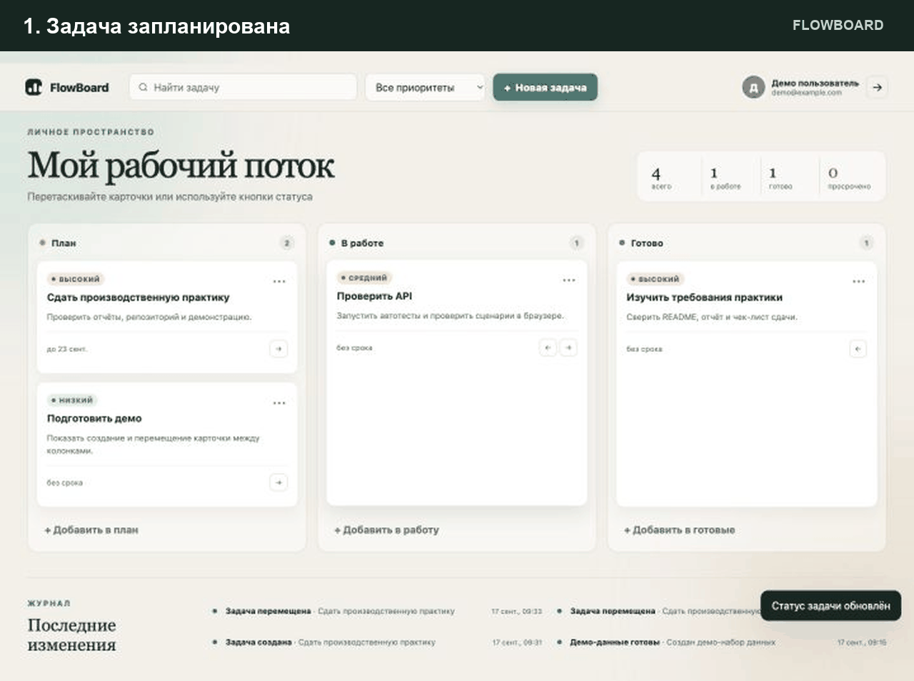

# FlowBoard

[](https://github.com/crankoff/PP_09.02.07/actions/workflows/ci.yml)
[](https://www.python.org/)
[](https://sqlite.org/)

FlowBoard — полностековая канбан-доска для личных и учебных задач. Пользователь может создавать карточки, задавать им приоритет и срок, перемещать между этапами и следить за прогрессом. Данные аккаунтов изолированы, а все изменения фиксируются в журнале.

Проект выполнен для производственной практики по специальности 09.02.07. В качестве основы выбран проект [Create a Trello Clone из утверждённого каталога](https://github.com/practical-tutorials/project-based-learning#react). Реализация, дизайн, API и схема данных разработаны самостоятельно.



## Возможности

- регистрация и вход с безопасным хешированием пароля;
- создание, редактирование и удаление задач;
- три этапа потока: план, в работе, готово;
- drag-and-drop и доступные кнопки перемещения;
- приоритеты, сроки и индикация просроченных задач;
- поиск, фильтр и сводная статистика;
- журнал действий и оптимистическая блокировка конкурентных изменений;
- миграции, проверка целостности, backup и restore SQLite;
- 17 автотестов сервисного слоя, безопасности и HTTP API.

## Стек

| Слой | Технологии |
|---|---|
| Frontend | HTML5, CSS3, JavaScript ES2022, Fetch API, Drag and Drop API |
| Backend | Python 3.12, `http.server`, модульная сервисная архитектура |
| База данных | SQLite 3, SQL-миграции, foreign keys, CHECK, UNIQUE, индексы |
| Безопасность | `scrypt` (PBKDF2 fallback), HMAC-SHA256, HttpOnly/SameSite cookie, CSRF, CSP, rate limit |
| Тесты и CI | `unittest`, GitHub Actions |
| Развёртывание | Docker, Render Blueprint |

## Быстрый старт

Требуется Python 3.12+. Внешние Python-пакеты не нужны.

```bash
git clone https://github.com/crankoff/PP_09.02.07.git
cd PP_09.02.07
python3 app.py
```

Откройте <http://localhost:8000>. При первом запуске применятся миграции и будет создан демо-аккаунт:

```text
login: demo@example.com
password: Demo123!
```

Для production обязательно задайте длинный `SECRET_KEY` и `COOKIE_SECURE=1`. Все параметры есть в [.env.example](.env.example).

## Тесты

```bash
python3 -m unittest discover -v
```

Полная проверка компиляции, тестов и БД:

```bash
make check
DATABASE_PATH=/tmp/flowboard-check.db python3 scripts/db_admin.py init
DATABASE_PATH=/tmp/flowboard-check.db python3 scripts/db_admin.py check
```

## Администрирование базы

```bash
python3 scripts/db_admin.py init
python3 scripts/db_admin.py stats
python3 scripts/db_admin.py check
python3 scripts/db_admin.py backup backups/flowboard.db
python3 scripts/db_admin.py restore backups/flowboard.db --force
```

Восстановление требует явного `--force`; перед записью утилита проверяет `PRAGMA integrity_check` исходной копии.

## API и архитектура

- [OpenAPI 3.0](openapi.yaml)
- [Архитектура и сценарии](docs/architecture.md)
- [Модель и администрирование БД](docs/database.md)
- [Требования](docs/requirements.md)
- [План и результаты тестирования](docs/test-plan.md)
- [Развёртывание](docs/deployment.md)

## Отчёты по практике

- [Отчёт ПМ.02](reports/Отчет_ПМ02_FlowBoard.docx)
- [Отчёт ПМ.11](reports/Отчет_ПМ11_FlowBoard.docx)
- [Чек-лист перед сдачей](reports/README.md)

В отчётах оставлены пустыми только неизвестные персональные поля: ФИО, курс, группа, оценки и подписи.

## Docker

```bash
docker build -t flowboard .
docker run --rm -p 8000:8000 \
  -e SECRET_KEY='replace-with-a-long-random-value' \
  -v flowboard-data:/app/data \
  flowboard
```

## Деплой

Репозиторий содержит `render.yaml` для бесплатного демо с health check. Файловая система Free-сервиса эфемерна: демо-данные могут сбрасываться при новом deploy. Для постоянного хранения нужен платный persistent disk и `DATABASE_PATH=/var/data/flowboard.db`. После публикации репозитория бесплатное демо создаётся кнопкой:

[](https://render.com/deploy?repo=https://github.com/crankoff/PP_09.02.07)

## Безопасность

- Пароли хешируются `scrypt` с уникальной 128-битной солью; для сборок Python без `hashlib.scrypt` предусмотрен PBKDF2-HMAC-SHA256 с 600 000 итераций.
- Сессии подписаны HMAC-SHA256 и хранятся в `HttpOnly`, `SameSite=Lax` cookie.
- Изменяющие запросы защищены CSRF-токеном.
- SQL-запросы параметризованы; доступ к задаче всегда проверяет `user_id`.
- Включены CSP, `X-Frame-Options`, `nosniff`, ограничение тела и rate limit для входа.
- В схеме SQLite применены `FOREIGN KEY`, `CHECK`, `UNIQUE`, индексы и транзакции.

## Структура

```text
kanban/            backend: config, DB, security, business logic, HTTP
public/            frontend: HTML, CSS, JavaScript
migrations/        versioned SQL schema
scripts/           database administration
tests/             unit, integration and HTTP API tests
docs/              architecture, DB, requirements, test plan, deployment
reports/           practice reports and submission checklist
openapi.yaml       REST API contract
```

## Лицензия

[MIT](LICENSE)
