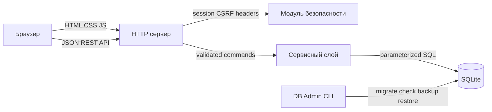
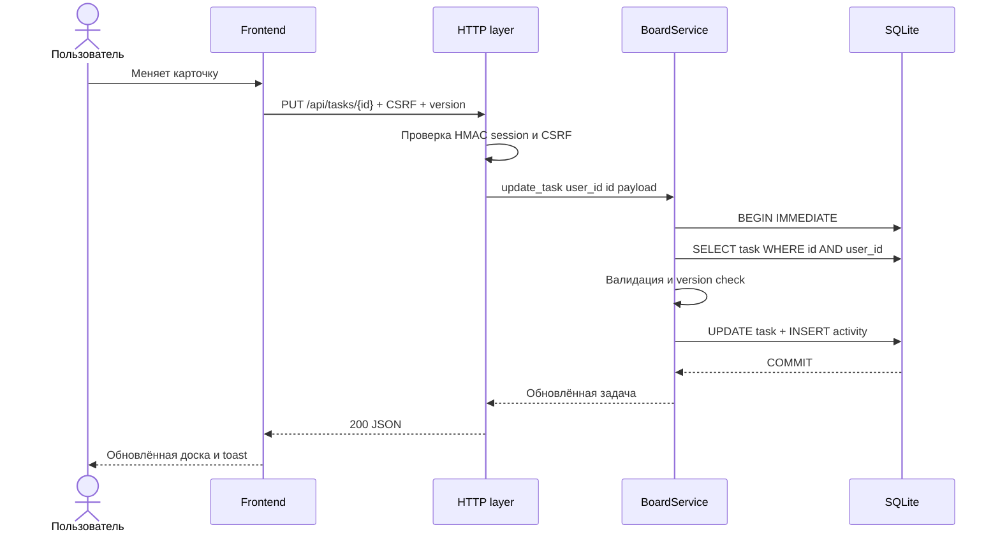
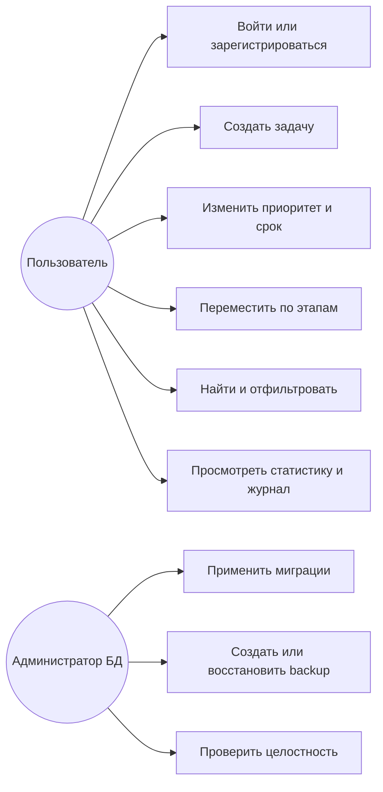

# Архитектура FlowBoard

## Общая схема

Браузер загружает статический frontend с того же origin, поэтому приложению не нужен CORS. JavaScript обращается к REST API и хранит только текущее UI-состояние. HTTP-слой проверяет сессию, CSRF-токен и размер запроса, затем передаёт команду в сервисный слой. `BoardService` содержит валидацию, правила доступа и границы транзакций. `Database` управляет SQLite-соединениями, миграциями и целостностью. Отдельная CLI-утилита даёт администратору операции без доступа к веб-интерфейсу.

## Поток запроса на изменение задачи

## Use Case

### UC-01 Вход

1. Пользователь вводит email и пароль.
2. Сервер находит аккаунт и проверяет маркированный scrypt-хеш (либо PBKDF2-хеш в совместимой сборке Python).
3. Сервер возвращает подписанную HttpOnly cookie и CSRF-токен.
4. Интерфейс загружает доску, статистику и журнал.

### UC-02 Создание задачи

1. Пользователь открывает диалог и заполняет название, описание, статус, приоритет и срок.
2. Frontend посылает `POST /api/tasks` с CSRF-токеном.
3. Сервис валидирует поля и в одной транзакции добавляет задачу и запись журнала.
4. Доска, счётчики и журнал обновляются.

### UC-03 Перемещение задачи

1. Пользователь перетаскивает карточку в другую колонку или нажимает стрелку.
2. Frontend передаёт новый status и текущую version.
3. Сервис проверяет владельца и конфликт версий, затем обновляет запись.
4. Обновлённая карточка появляется в целевой колонке.

### UC-04 Резервное копирование

1. Администратор вызывает `db_admin.py backup` с целевым путём.
2. Утилита открывает БД с теми же PRAGMA и использует SQLite Online Backup API.
3. Копия получает согласованное состояние даже при работающем приложении.
4. Путь готовой копии печатается в консоль.

## Решения и компромиссы

- Стандартная библиотека Python упрощает локальный запуск, но HTTP-слой остаётся учебным; для высокой production-нагрузки нужен WSGI/ASGI-сервер.
- SQLite подходит для одного экземпля приложения. При горизонтальном масштабировании следует перейти на PostgreSQL.
- Статусы заданы CHECK-ограничением, а не отдельной таблицей, потому что набор фиксирован требованиями.
