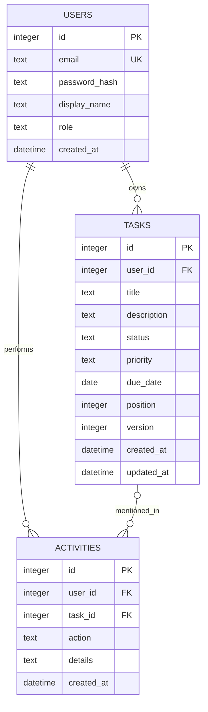

# Модель и администрирование базы данных

## ERD



## Сущности

| Таблица | Назначение | Целостность |
|---|---|---|
| `users` | Учётные записи | `email UNIQUE COLLATE NOCASE`, длина имени, роль из фиксированного набора |
| `tasks` | Карточки доски | FK на `users` с CASCADE; CHECK длин, status, priority, date, position и version |
| `activities` | Аудит операций | FK на `users` с CASCADE; FK на `tasks` с SET NULL сохраняет событие после удаления задачи |
| `schema_migrations` | Версии схемы | Имя SQL-файла — PK; каждая миграция применяется один раз |

## Нормализация

Схема доведена до третьей нормальной формы. Каждое поле атомарно; все неключевые атрибуты зависят от первичного ключа своей таблицы и не зависят друг от друга. Данные аккаунта не дублируются в задачах; владелец задаётся FK. Журнал вынесен отдельно от текущего состояния задачи.

## Индексы

- `users.email` — уникальный индекс для входа и защиты от дублей;
- `idx_tasks_user_status_position` — основная выборка колонки в порядке;
- `idx_tasks_user_priority` — фильтр по приоритету;
- `idx_activities_user_created` — последние события аккаунта.

## Транзакции и конкурентность

Изменяющие операции выполняются в `BEGIN IMMEDIATE`: изменение задачи и запись журнала либо фиксируются вместе, либо вместе откатываются. `version` реализует optimistic locking и защищает от незаметной перезаписи более нового изменения. WAL даёт читателям работать во время записи.

## Защита информации

| Риск | Мера |
|---|---|
| Утечка пароля | scrypt с индивидуальной солью; PBKDF2 fallback для совместимости; исходный пароль не записывается |
| SQL injection | Все значения передаются параметрами `?`; динамически собираются только фиксированные фрагменты |
| Чужие задачи | Каждый SELECT/UPDATE/DELETE для задачи включает `user_id = ?` |
| Нарушение схемы | `FOREIGN KEY`, `CHECK`, `UNIQUE`, `NOT NULL`, транзакции |
| Потеря файла | SQLite Online Backup API, persistent volume, проверка backup перед restore |

## Административные операции

```bash
# Применить недостающие миграции
python3 scripts/db_admin.py init

# Проверить все страницы и индексы
python3 scripts/db_admin.py check

# Показать контрольные счётчики
python3 scripts/db_admin.py stats

# Создать согласованную копию
python3 scripts/db_admin.py backup backups/flowboard.db

# Восстановить после явного подтверждения
python3 scripts/db_admin.py restore backups/flowboard.db --force
```

Перед восстановлением нужно остановить веб-сервер. Утилита проверяет копию через `PRAGMA integrity_check`, но не может проверить её бизнес-актуальность.
